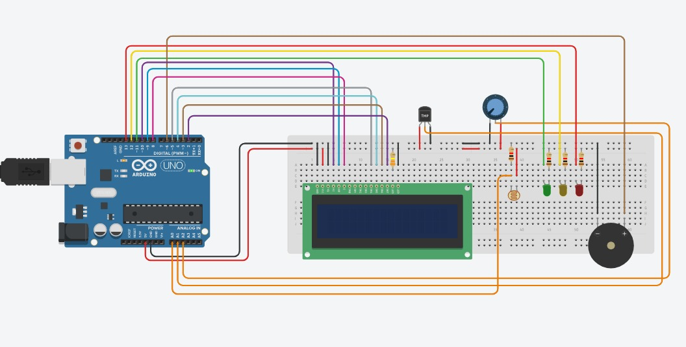
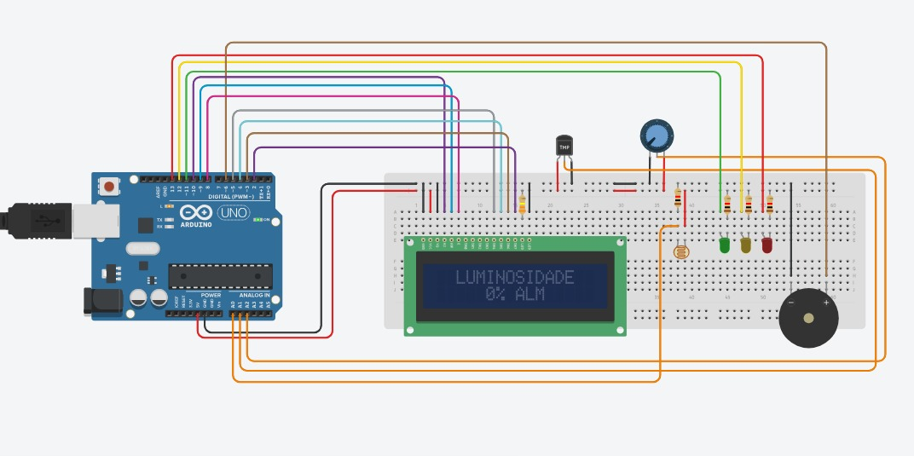

# Descrição do Projeto-Vinharia Agnello 🍷

Projeto desenvolvido como parte do desafio acadêmico proposto pela FIAP, com base no cenário fictício da empresa Vinheria Agnello.  
O sistema embarcado tem como objetivo monitorar a luminosidade do ambiente, garantindo que os vinhos sejam armazenados sob condições ideais de conservação.

O projeto utiliza um sensor LDR para detectar a luz ambiente, realiza calibração dinâmica, apresenta o status via display LCD e aciona alertas visuais (LEDs) e sonoros (buzzer) conforme o nível de luminosidade.

## Circuito
-Simulação do circuito desligado

-Simulação do circuito ligado

## Funcionalidades
- Exibição de animação de boas-vindas no LCD  
- Calibração automática da luminosidade mínima e máxima  
- Conversão das leituras do sensor em escala percentual (0% a 100%)  
- Sinalização visual com 3 LEDs:  
  -  Verde → nível ideal  
  -  Amarelo → nível de atenção  
  -  Vermelho + buzzer → luz excessiva  
- Exibição contínua do nível de luz atual no LCD 

## Componentes Utilizados

| Componente       | Quantidade | Descrição                                  |
|------------------|------------|----------------------------------------------|
| Arduino Uno      | 1x         | Microcontrolador principal                  |
| Sensor LDR       | 1x         | Sensor de luminosidade                      |
| Display LCD 16x2 | 1x         | Interface de exibição                       |
| LEDs (RGB)       | 3x         | Verde, amarelo e vermelho para sinalização  |
| Buzzer           | 1x         | Alerta sonoro                               |
| Push Button      | 1x         | Botão para calibração                       |
| Resistores 220Ω  | 3x         | Limitadores de corrente para LEDs           |
| Resistor 10kΩ    | 1x         | Para o sensor LDR                           |
| Protoboard       | 1x         | Montagem do circuito                        |
| Jumpers          | Diversos   | Conexões entre os componentes               |

## 📂 Estrutura do projeto

├── vinheria_agnello.ino # Código principal do sistema embarcado
├── imgs/
│ └── image_circuit.png # Imagem do circuito 
├── README.md # Documentação do projeto

##  Como Replicar este Projeto
1. Utilize a Arduino IDE (ou simulação via [WokWI](https://wokwi.com/)).  
2. Monte o circuito conforme o diagrama disponível em `imgs/image_circuit.png`.  
3. Carregue o código presente no arquivo `vinheria_agnello.ino`.  
4. Alimente o circuito com 5V.  
5. Pressione o botão quando solicitado para realizar a calibração de luz mínima e máxima.  
6. O sistema iniciará o monitoramento automaticamente após a calibração.  

---

## Lógica do Sistema
- Ao iniciar, o sistema mostra uma animação no LCD e entra no modo de calibração.  
- A calibração é feita pressionando o botão em dois momentos:  
  - 1ª vez → define a luminosidade mínima  
  - 2ª vez → define a luminosidade máxima  
- A cada ciclo:  
  - O sensor LDR realiza 10 leituras (100ms de intervalo).  
  - A média é convertida em uma **porcentagem (0% a 100%).  
  - O valor percentual é exibido no LCD.  
  - Dependendo do nível de luminosidade:  
    - ≤ 40% → LED verde  
    - > 40% e ≤ 70% → LED amarelo  
    - > 70% → LED vermelho + buzzer ativo por 3s  

---

## 📋 Requisitos

- Arduino IDE 1.8+ ou simulação via WokWI  
- Biblioteca: LiquidCrystal.h (já inclusa por padrão na IDE)  

---

## 👨‍💻 Equipe

-César Andre Zanin Filho - Rm:567615
-Gabriel Amparo Evangelista Santo -568274
-Murilo Jeronimo Ferreira Nunes - Rm:560641
-Pedro Olavo Jung da Silva - Rm:567182
-Vinicius Kozonoe Guaglini - Rm:567264  

